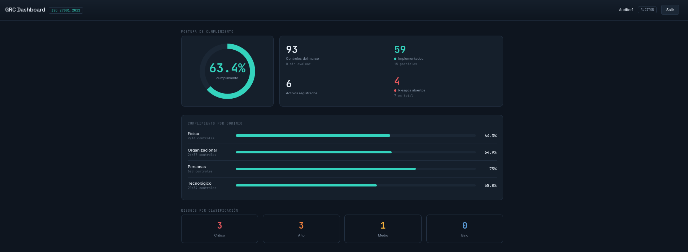

# GRC Compliance Dashboard

Plataforma full stack para gestionar el cumplimiento de seguridad de la
información de una organización conforme a **ISO/IEC 27001:2022**. Permite mapear
activos a controles del Anexo A, registrar riesgos, evaluar el estado de cada
control y visualizar la postura de cumplimiento en un panel en tiempo real.

> Proyecto que une desarrollo full stack con gobierno, riesgo y cumplimiento
> (GRC), bajo un enfoque *security by design*. La propia aplicación implementa
> los controles que mide: control de acceso por roles, segregación de funciones
> y autenticación robusta.




## Características

- **Catálogo ISO 27001:2022 completo** — los 93 controles del Anexo A,
  organizados en sus 4 temas (Organizacional, Personas, Físico, Tecnológico),
  cargados mediante un comando reproducible.
- **Gestión de activos** con tipo y nivel de criticidad.
- **Registro de riesgos** con matriz probabilidad × impacto y clasificación
  automática (Bajo / Medio / Alto / Crítico).
- **Evaluación de controles** con estado, evidencias y trazabilidad de quién
  evaluó.
- **Dashboard** con porcentaje de cumplimiento global, desglose por dominio y
  resumen de riesgos.
- **Control de acceso por roles (RBAC)** — Auditor y Responsable, con
  segregación de funciones.
- **API REST** segura, navegable y autenticada por token.

## Stack

| Capa | Tecnología |
|---|---|
| Backend | Django 6 · Django REST Framework |
| Base de datos | PostgreSQL (SQLite como fallback local) |
| Frontend | React 18 · Vite · Recharts |
| Autenticación | Token (DRF) + sesión |
| Infraestructura | Docker · Docker Compose |

## Arquitectura

```
+--------------+     /api (proxy)     +--------------+      +------------+
|  React (Vite)| -------------------> | Django + DRF | ---> | PostgreSQL |
|  Dashboard   | <--- JSON + token -- |   API REST   |      |            |
+--------------+                      +--------------+      +------------+
```

El frontend consume la API mediante token. La lógica de negocio (cálculo de
riesgo, agregación de métricas, permisos) vive en el backend; el frontend solo
presenta.

## Estructura del proyecto

```
grc-dashboard/
├── backend/
│   ├── config/              # settings, urls, wsgi
│   ├── compliance/          # app principal
│   │   ├── models.py        # Framework, Control, Asset, Risk, ControlAssessment
│   │   ├── serializers.py   # serializers de DRF
│   │   ├── views.py         # viewsets de la API
│   │   ├── permissions.py   # control de acceso por roles
│   │   ├── dashboard.py     # endpoint de métricas + login con token
│   │   └── management/commands/
│   │       ├── load_iso27001.py   # carga los 93 controles
│   │       ├── setup_roles.py     # crea los grupos de roles
│   │       └── seed_demo.py       # datos de demostración
│   ├── requirements.txt
│   └── Dockerfile
├── frontend/
│   └── src/
│       ├── api.js
│       ├── App.jsx
│       └── components/      # Login, Dashboard
├── docker-compose.yml
└── README.md
```

## Instalación (desarrollo local)

### Requisitos
- Python 3.12+
- Node.js 18+
- (Opcional) PostgreSQL; si se omite, usa SQLite.

### Backend

```bash
cd backend
python -m venv .venv && source .venv/bin/activate
pip install -r requirements.txt
cp .env.example .env            # ajusta los valores
python manage.py migrate
python manage.py load_iso27001  # carga los 93 controles ISO
python manage.py setup_roles    # crea los roles Auditor y Responsable
python manage.py createsuperuser
python manage.py seed_demo       # (opcional) datos de demostración
python manage.py runserver
```

La API queda en `http://127.0.0.1:8000/api/`.

### Frontend

```bash
cd frontend
npm install
npm run dev
```

El dashboard queda en `http://localhost:5173/`. Inicia sesión con el
superusuario creado. (El `vite.config.js` redirige `/api` al backend.)

## Ejecución con Docker

```bash
cp backend/.env.example backend/.env   # ajusta los valores
docker compose up --build
```

## Comandos de gestión

| Comando | Descripción |
|---|---|
| `python manage.py load_iso27001` | Carga los 93 controles del Anexo A (idempotente). |
| `python manage.py setup_roles` | Crea los grupos de roles Auditor y Responsable. |
| `python manage.py seed_demo` | Siembra activos, riesgos y evaluaciones de ejemplo. |

## Roles y permisos (RBAC)

| Acción | Auditor | Responsable | Admin |
|---|:---:|:---:|:---:|
| Leer catálogo, activos y riesgos | Sí | Sí | Sí |
| Crear / editar evaluaciones de control | Sí | Sí | Sí |
| Crear / editar activos y riesgos | No | Sí | Sí |
| Editar el catálogo ISO | No | No | Sí |
| Borrar registros | No | No | Sí |

La asignación de usuarios a cada rol se hace desde el panel de administración.

## Endpoints principales

| Método | Ruta | Descripción |
|---|---|---|
| POST | `/api/login/` | Autentica y devuelve un token + roles. |
| GET | `/api/dashboard/` | Métricas agregadas del panel. |
| GET/POST | `/api/frameworks/` | Marcos normativos. |
| GET/POST | `/api/controls/` | Controles (admite `?search=`). |
| GET/POST | `/api/assets/` | Activos. |
| GET/POST | `/api/risks/` | Riesgos. |
| GET/POST | `/api/assessments/` | Evaluaciones de control. |

## Decisiones de seguridad

- Secretos y credenciales fuera del código, leídos de variables de entorno.
- API cerrada por defecto: requiere autenticación (`IsAuthenticated`).
- Control de acceso basado en roles y segregación de funciones.
- Autenticación por token para el frontend; CORS restringido al origen del
  cliente.
- Validadores de contraseña de Django activos.

## Mapeo a controles ISO 27001

La aplicación implementa, sobre sí misma, varios de los controles que gestiona:

| Control | Implementación en el proyecto |
|---|---|
| A.5.3 Segregación de funciones | Roles Auditor / Responsable con permisos distintos. |
| A.5.15 Control de acceso | Permisos por rol en cada endpoint. |
| A.5.17 Información de autenticación | Autenticación por token; contraseñas con hashing. |
| A.8.2 Derechos de acceso privilegiado | Operaciones destructivas reservadas al admin. |

## Roadmap

- [ ] Exportación del reporte ejecutivo a PDF.
- [ ] Gestión de evidencias con almacenamiento de archivos.
- [ ] Vistas CRUD completas en el frontend (controles, activos, riesgos).
- [ ] Pipeline CI/CD con análisis SAST/DAST.

## Licencia

MIT — uso libre con atribución.

---

Desarrollado por **Rod Barrera** · Ingeniero en Ciberseguridad.
